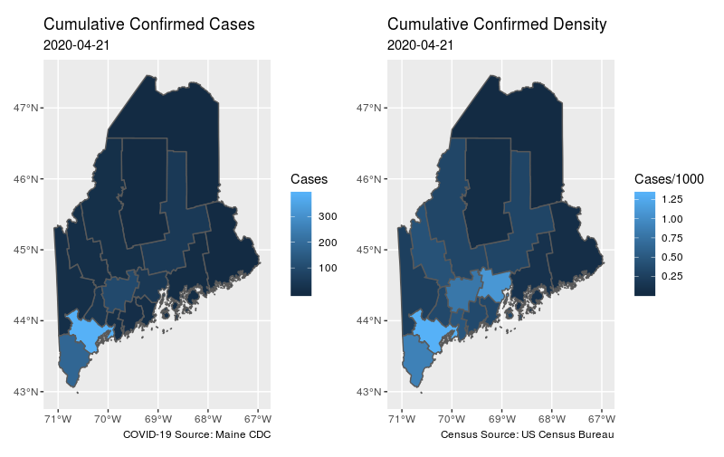

# stcovid: COVID-19 cases viewer at county level by US state.

Data from [COVID19 data hub](https://github.com/covid19datahub/COVID19) provides historical cumulative counts if COIVID-19 cases. 

Data from [US Census](https://www.census.gov/) accessed using [tidycensus](https://CRAN.R-project.org/package=tidycensus).

While this has been developed for [Computational Oceanography Lab](https://www.bigelow.org/science/lab/computational-oceanography/) coding ecosystem and [Bigelow Lab](https://www.bigelow.org/) it would be easy to adapt to other settings.

### Requirements

 + [R](https://www.r-project.org/)

 + [tidycensus](https://CRAN.R-project.org/package=tidycensus)
 
 + [sf](https://CRAN.R-project.org/package=sf)
 
 + [rlang](https://CRAN.R-project.org/package=rlang)
 
 + [dplyr](https://CRAN.R-project.org/package=dplyr)
 
 + [readr](https://CRAN.R-project.org/package=readr)
 
 + [ggplot2](https://CRAN.R-project.org/package=ggplot2)
 
 + [patchwork](https://CRAN.R-project.org/package=patchwork)

### Installation

```
remotes::install_github("BigelowLab/stcovid"")
```

### Usage

Read a daily update of cumulative cases in Maine.  If you don't have the data yet then
first download them with `fetch_datahub`.

```
library(stcovid)
x <- stcovid::read_datahub(state = "Maine", date = as.Date("2020-04-20"))
tail(x)
# # A tibble: 6 x 7
#   date       State County      Confirmed Recovered Hospitalizations Deaths
#   <date>     <chr> <chr>           <dbl>     <dbl>            <dbl>  <dbl>
# 1 2020-04-20 Maine Piscataquis         1         0                0      0
# 2 2020-04-20 Maine Sagadahoc          16         0                0      0
# 3 2020-04-20 Maine Somerset           16         0                0      0
# 4 2020-04-20 Maine Waldo              43         0                0      8
# 5 2020-04-20 Maine Washington          2         0                0      0
# 6 2020-04-20 Maine York              181         0                0      6
```

Merge it with census data.  If you dont have the census data yet, you can use
`fetch_census_estimates` to collect them.

```
pop <- stcovid::read_census("Maine")
pop
# Simple feature collection with 16 features and 4 fields
# geometry type:  MULTIPOLYGON
# dimension:      XY
# bbox:           xmin: -71.08392 ymin: 42.97776 xmax: -66.9499 ymax: 47.45969
# CRS:            4269
# # A tibble: 16 x 5
#    geoid County          pop density                                                                               geometry
#    <chr> <chr>         <dbl>   <dbl>                                                                     <MULTIPOLYGON [°]>
#  1 23001 Androscoggin 107679  230.   (((-70.48529 44.0604, ...
#  2 23003 Aroostook     67111   10.1  (((-70.01975 46.59217,...
#  3 23005 Cumberland   293557  351.   (((-69.94153 43.73007,...
#  4 23007 Franklin      29897   17.6  (((-70.83554 45.2938, ...
#  5 23009 Hancock       54811   34.5  (((-68.03522 44.33274,...
#  6 23011 Kennebec     122083  141.   (((-70.13259 44.37138,...
#  7 23013 Knox          39771  109.   (((-68.55926 44.04502,...
#  8 23015 Lincoln       34342   75.3  (((-69.32357 43.75899,...
#  9 23017 Oxford        57618   27.7  (((-71.08    45.30699,...
# 10 23019 Penobscot    151096   44.5  (((-69.35567 45.07347,...
# 11 23021 Piscataquis   16800    4.24 (((-69.83118 45.7386, ...
# 12 23023 Sagadahoc     35634  140.   (((-69.76031 43.71044,...
# 13 23025 Somerset      50592   12.9  (((-70.55279 45.66784,...
# 14 23027 Waldo         39694   54.4  (((-68.94229 44.28436,...
# 15 23029 Washington    31490   12.3  (((-67.3226  44.6116, ...
# 16 23031 York         206229  208.   (((-70.61725 42.99202,...

x <- stcovid::merge_census(x, pop)
x
# Simple feature collection with 16 features and 9 fields
# geometry type:  MULTIPOLYGON
# dimension:      XY
# bbox:           xmin: -71.08392 ymin: 42.97776 xmax: -66.9499 ymax: 47.45969
# CRS:            4269
# # A tibble: 16 x 10
#    date       geoid County     pop density Confirmed Recovered Hospitalizations Deaths                  geometry
#    <date>     <chr> <chr>    <dbl>   <dbl>     <dbl>     <dbl>            <dbl>  <dbl>        <MULTIPOLYGON [°]>
#  1 2020-04-20 23001 Andros… 107679  230.          35         0                0      1 (((-70.48529 44.0604, ...
#  2 2020-04-20 23003 Aroost…  67111   10.1          2         0                0      0 (((-70.01975 46.59217,...
#  3 2020-04-20 23005 Cumber… 293557  351.         380         0                0     16 (((-69.94153 43.73007,...
#  4 2020-04-20 23007 Frankl…  29897   17.6         13         0                0      0 (((-70.83554 45.2938, ...
#  5 2020-04-20 23009 Hancock  54811   34.5          6         0                0      0 (((-68.03522 44.33274,...
#  6 2020-04-20 23011 Kenneb… 122083  141.          97         0                0      4 (((-70.13259 44.37138,...
#  7 2020-04-20 23013 Knox     39771  109.          12         0                0      0 (((-68.55926 44.04502,...
#  8 2020-04-20 23015 Lincoln  34342   75.3         12         0                0      0 (((-69.32357 43.75899,...
#  9 2020-04-20 23017 Oxford   57618   27.7         14         0                0      0 (((-71.08    45.30699,...
# 10 2020-04-20 23019 Penobs… 151096   44.5         44         0                0      0 (((-69.35567 45.07347,...
# 11 2020-04-20 23021 Piscat…  16800    4.24         1         0                0      0 (((-69.83118 45.7386, ...
# 12 2020-04-20 23023 Sagada…  35634  140.          16         0                0      0 (((-69.76031 43.71044,...
# 13 2020-04-20 23025 Somers…  50592   12.9         16         0                0      0 (((-70.55279 45.66784,...
# 14 2020-04-20 23027 Waldo    39694   54.4         43         0                0      8 (((-68.94229 44.28436,...
# 15 2020-04-20 23029 Washin…  31490   12.3          2         0                0      0 (((-67.3226  44.6116, ...
# 16 2020-04-20 23031 York    206229  208.         181         0                0      6 (((-70.61725 42.99202,...
```


Make a graphic that shows cumulative counts and density by county.

```
library(patchwork)
gg <- stcovid::draw_statemap(x)
print(gg[[1]] + gg[[2]])
```

